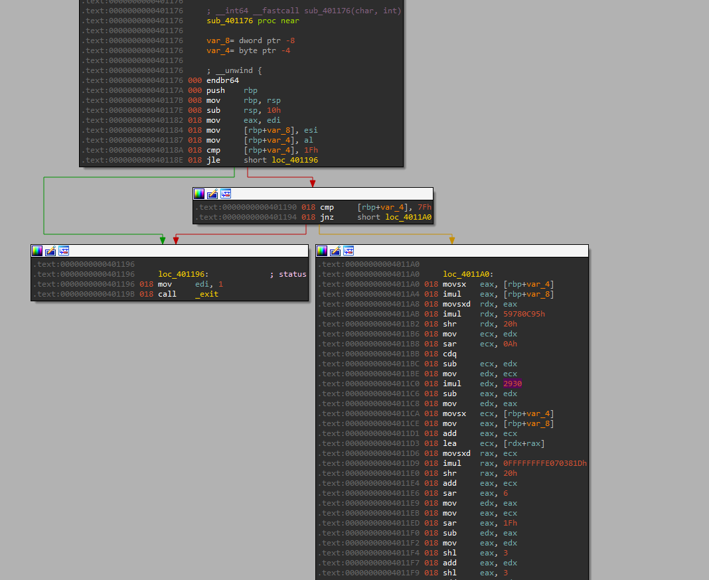
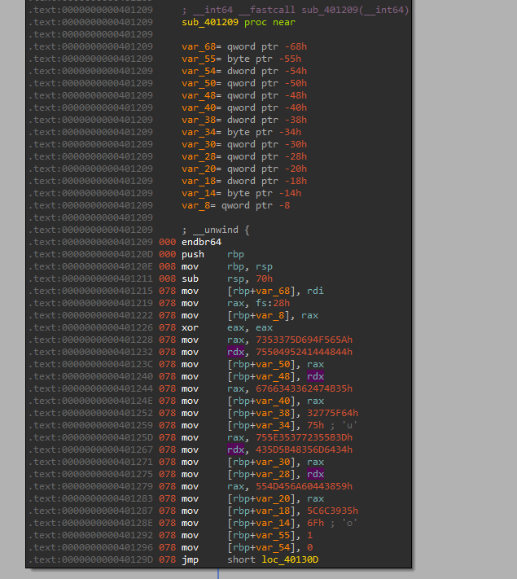
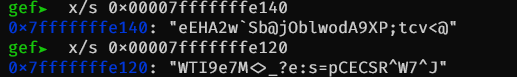
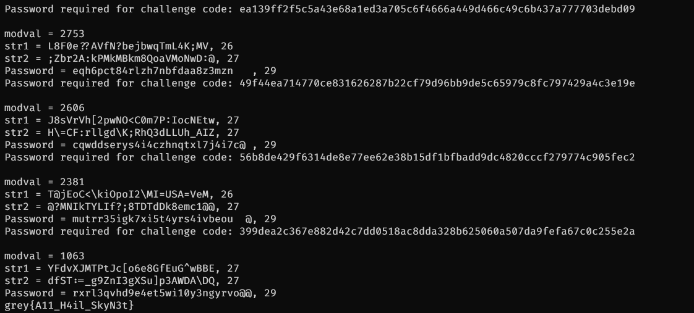

# Angry Robot

```
Author: rootkid

You have entered a top secret robot production facilities and your clumsy friend tripped the alarm. You and your friends are about to be "decontaminated".

Luckily, you have unpacked the authentication firmware during previous reconaissance. Can you use them to override the decontamination process?
```

## Roger, Roger

This was a painful but extremely educational challenge.
With the benefit of a bit of hacky GDB shenanigans and some luck, we managed to solve it.

## Losing It

Taking a look at the challenge tarball, we see that we have a collection of 100 binaries.

```bash
❯ ls -1
03e73f2bd4c480b209caa321eb3e2eb974b680e2ec7cbada8cfd457375eaa3c0
04480e6a6ad345bf50f4f428f802656264d4738a000270d8967734cecd0ba2a9
08d4a97677fd1c8d14b069b9922518e5c7a680b67417990d998c41357d4c7c14
1136ab8398d16581aac4940f28fc05860d8272979e9452504eebd62f42ef0128
...
```

We can perform a brief recon of the provided service, to test what the challenge is looking for.

```
❯ nc challs.nusgreyhats.org 10523
Unauthorized access detected.
Decontamination in 10 minutes
Do you wish to override? (y/n)
y
Password required for challenge code: 7d49a85af81848f0e491dd76c1c2b0b0f6410b0c92808255ab74738a709cfabb
```

I made an educated guess that the service will randomly prompt for the password of a binary that comes in the downloaded tarball. I felt it wasn't too large a leap of logic to assume that the challenge would require us to solve for all 100 binaries within 10 minutes, i.e. 600 seconds. There's no way we are manually reversing a binary at a rate of 1 every 6 seconds. Some form of automation is required, then.

Opening a few of the attached binaries in IDA Pro, we see that they're the same. Well, almost.
They perform roughly the same functions, with slight but important differences that I'll elaborate on later.
I'll use code snippets from `1a0ac4eb514b129844e15c2fad569f523c5701e146fffa3d51d6e5868b304da3` to demonstrate, for the interested reader who wishes to follow along.

1. The main function calls `fgets()`, receiving an input from the user.
```c
_BOOL8 __fastcall main(int a1, char **a2, char **a3)
{
  char s[8]; // [rsp+0h] [rbp-30h] BYREF
  // * snip *
  
  fgets(s, 30, stdin);
  return (unsigned __int8)sub_401209((__int64)s) == 0;
}
```

2. This input is then passed to `sub_401209`. This function is a "password checker" - it calls a further subfunction, `sub_401176`. Two stack variables, both containing strings of the same length, are initialized.
```c
__int64 __fastcall sub_401209(__int64 user_input_base)
{
  unsigned __int8 v2; // [rsp+1Bh] [rbp-55h]
  int i; // [rsp+1Ch] [rbp-54h]
  __int64 v4[4]; // [rsp+20h] [rbp-50h] BYREF
  __int64 v5[6]; // [rsp+40h] [rbp-30h] BYREF

  v5[5] = __readfsqword(0x28u);
  qmemcpy(v4, "ZVOi]7SsDHDARIPu5KGb34fgd_w2u", 29); // stack string 1
  qmemcpy(v5, "=[5r75^u4dm5H[]CY8D`jEMU59l\\o", 29); // stack string 2
  v2 = 1;
  for ( index = 0; index <= 28; ++index ) // iterating through input string
  {
    if ( (unsigned __int8)sub_401176(*(_BYTE *)(index + user_input_base), index) != *((_BYTE *)v4 + index) // condition 1 checked
      || (unsigned __int8)sub_401176(*(_BYTE *)(index + user_input_base), *((char *)v4 + index)) != *((_BYTE *)v5 + index) ) // condition 2 checked
    {
      v2 = 0;
    }
  }
  return v2;
}
```

3. `sub_401176` is run character-by-character on the user's input. This function does nothing much except check for the correctness of the inputted password. 
    * The first time, the user's input is run with the current index as the second argument. This is then checked for equivalency with the first stack string.
    * The second time, the user's input is run, with the first stack string as an argument. This is also then checked for equivalency with the second stack string.
```c
__int64 __fastcall sub_401176(char a1, int a2)
{
  if ( a1 <= 31 || a1 == 127 )
    exit(1);
  return (unsigned int)((a2 * a1 % 2930 + a1 + a2) % 73 + 48); // observe the constant 2930
}
```

4. The output of `sub_401209` is then checked for equivalency with 0. We can assume that the correct password would return 0.
```bash
❯ ./ab1e1819572f6334a29de95744923e30d905557de8ee88375527d8c75e7f2a57 ; echo $?
abcd
1
```

Now we're aware of the basic template each program follows, we can elaborate on the differences between each program.
I've added comments in code snippets above, indicating the two stack strings in `sub_401209` and the modulo constant in `sub_401176`. These three distinct values vary from program to program. Creating a way to extract them, solve for the password, and then send it automatically would be key to solving this challenge.

At this point, there are a few possibilities to solve the challenge.
    * Since we have all the challenge binaries, we could solve all of them manually, and then send their passwords to the service when queried.
    * We could attempt to solve the challenge binaries automatically. This would require automatic extraction of the constants from the binaries, and a way to solve for the given constraints.

I decided to go with the second method, to push myself. Automatic reversing has always been an area of interest, and this seemed as good a way to get my hands dirty as any.

## Terminator

Even after deciding on automatic reversal, there were a few more choices to make.
* Constants could either be extracted statically, or dynamically. I opted for the former, first.
* Solving for the password - this could be done using a bruteforce. But how so?

Initially, I wanted to extract constants statically and with a simple character-based bruteforce in the name of speed, since I assumed that valid input characters would be printable strings.

Observing the disassembly of `sub_401176`, we can observe that the constant is the second argument of the third `imul` instruction.



Since `sub_401176` is roughly constant across all the binaries, I hard-coded these observations into a simple script to obtain the constant statically.

```python
from elftools.elf.elffile import ELFFile
from capstone import *

def extract_constant(filename: str) -> int:

    with open(filename, "rb") as f:
        e = ELFFile(f)

        code = e.get_section_by_name(".text").data()
        mode = Cs(CS_ARCH_X86, CS_MODE_64)

        imul_counter = 0

        # # extract encrypted strings
        for i in mode.disasm(code, 0x401209):

            # extract testing algorithm constants
            if i.mnemonic == "imul":
                imul_counter += 1

                if imul_counter == 3:
                    c = int(i.op_str.split(",")[-1].strip(), 16)
        return c
```

I also put together a simple solve script for the password. As each of the individual checks had multiple possibilities, using the intersection of two sets containing their respective possible characters would yield the password, character by character.

```python
def test_input(a1: int, a2: int, const: int):
    if a1 <= 31 or a1 == 127:
        return False
    return (a2 * a1 % const + a1 + a2) % 73 + 48


def get_pw(in_1: str, in_2: str, const: int) -> str:
    pw = ""
    num_iters = len(in_1)
    for i in range(num_iters):
        prob_1 = set()
        prob_2 = set()
        for test_char in PRINTABLE:
            if test_input(ord(test_char), i, const) == ord(in_1[i]):
                # print(f"{test_char}")
                prob_1.add(test_char)

        for test_char in PRINTABLE:
            if test_input(ord(test_char), ord(in_1[i]), const) == ord(in_2[i]):
                # print(f"{test_char}")
                prob_2.add(test_char)

        try:
            pw += prob_1.intersection(prob_2).pop()
        except KeyError:
            print(pw)
            return pw
    return pw
```

I ran into some difficulty when attempting to extract the strings using the same method, however. As the strings are of different lengths, extracting them statically would be difficult.



The number of `mov` instructions, as well as their arguments would vary. Longer strings would not fit into single registers either and would be stored directly to stack variables in indirect `mov` calls.
At this point, I decided the best course of action moving forward was using a debugger to add a breakpoint once the stack strings were loaded into memory, and then dumping the stack values.

Jackpot! Using GDB, and adding a breakpoint at address `0x4012A9` once the stack strings were loaded would dump the stack strings out.

```
0x00007fffffffe100│+0x0000: 0x0000000100008000   ← $rsp
0x00007fffffffe108│+0x0008: 0x00007fffffffe180  →  0x0000000a64636261 ("abcd\n"?)
0x00007fffffffe110│+0x0010: 0x0000000000000040 ("@"?)
0x00007fffffffe118│+0x0018: 0x0000000001fa69a0
0x00007fffffffe120│+0x0020: "WTI9e7M<>_?e:s=pCECSR^W7^J"
0x00007fffffffe128│+0x0028: ">_?e:s=pCECSR^W7^J"
0x00007fffffffe130│+0x0030: "CECSR^W7^J"
0x00007fffffffe138│+0x0038: 0x0000000000004a5e ("^J"?)
```

With a stack dump command, we can even extract the strings in cleartext.



We can automatically extract these using a GDBScript command, which we call using the `subprocess` module.
This is a rather hacky solution that only works because we have local access to the binaries in their completeness. Perhaps next time, I will actually use symbolic execution and Angr as I imagine the challenge authors intended.

Here's the GDBScript:

```python
import os
import gdb
os.system("rm tmp.txt")
gdb.execute("set logging file tmp.txt")
gdb.execute("set logging on")
gdb.execute("break exit")
gdb.execute("r < dummyinput")
#gdb.execute("x/40s $sp+70")
gdb.execute("x/s 0x00007fffffffe140")
gdb.execute("x/s 0x00007fffffffe160")
gdb.execute("detach")
gdb.execute("quit")
gdb.execute("set logging off")
mainsec = open("tmp.txt").read()
```

```python
import subprocess

def clean_string(strs):
    strs = strs.replace("\\\\", "\\")
    return strs


def extract_strings(filename: str):
    result = subprocess.run(["gdb", filename, "-x", "gdb_script.py"], stdout=subprocess.DEVNULL)

    add1 = "0x7fffffffe140" # replace with locally debugged address
    add2 = "0x7fffffffe160"

    with open("tmp.txt", "r") as f:
        lines = f.readlines()

        for line in lines:
            if add1 in line:
                str1 = line.split("\t")[1].replace('"', '').strip()
            if add2 in line:
                str2 = line.split("\t")[1].replace('"', '').strip()

    clean_str1 = clean_string(str1)
    clean_str2 = clean_string(str2)

    return clean_str1, clean_str2
```

What this collection of code does is simply log the entire GDB output, extract the stack strings when printed to console, and then save them as Python variables.
We can also use Z3 to improve the solver, as I later realized. Z3 is an automatic equation solver developed by Microsoft, to put it simply. Defining a solver, and adding constraints for length, and the conditions we earlier discussed would allow the automatic solving of the password.

```python
from z3 import *

def solve_pass(str1: str, str2: str, modval: int) -> str:
    z = Solver()

    f = [BitVec('f{:02}'.format(i), 32) for i in range(29)]

    for idx, i in enumerate(f):
        z.add(i>= 32, i<=126)

    for x in range(len(str1)):
        z.add((((f[x] * x) % modval + x + f[x]) % 73 + 48) ==  ord(str1[x]))
        z.add((((f[x] * ord(str1[x])) % modval + ord(str1[x]) + f[x]) % 73 + 48) ==  ord(str2[x]))

    password = ''

    if z.check() == sat:
        password = ''.join(chr(z.model()[i].as_long()) for i in f)

    return password
```

With a bit more boilerplate code to handle connecting to the service, we can obtain the flag.

```python

s = remote("challs.nusgreyhats.org", 10523)
qn = s.recv(1024)
s.sendline(b"y")

while True:
    qn = s.recv(1024).decode("utf-8")
    print(qn)
    filename = f'../authentication/{qn.split(": ")[-1].strip()}'

    modval = extract_constant(filename)
    print(f"modval = {modval}")

    str1, str2 = extract_strings(filename)
    print(f"str1 = {str1}, {len(str1)}")
    print(f"str2 = {str2}, {len(str2)}")
    password = solve_pass(str1, str2, modval)

    print(f"Password = {password}, {len(password)}")
    s.sendline(bytes(password, 'utf-8'))

```

After 5 correct binaries solved in a row, the flag is sent back to us.
I suppose we didn't need to optimize the solution that much after all.



`grey{A11_H4il_SkyN3t}`